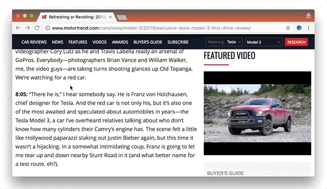
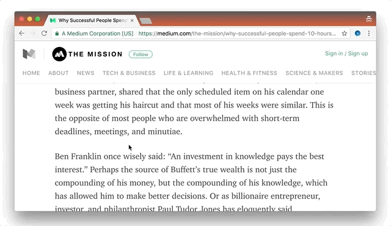

# TopScroll — Chrome extension

### Description
★ Click on the left border of any page for scroll to the top. Just pull the cursor to the left screen edge, click — and you're there!  
★ Click again — and you're back where stopped reading.  
  

★ Or right click for scroll to the bottom.  

There are already a number of Chrome extensions which can add the "scroll up" buttons in all possible places cluttering the precious screen space. With TopScroll you won't need such buttons and will be able to do rapid scrolling since moving the mouse to the left and clicking is the easiest thing to do.

If you use the browser not in fullscreen mode, you may want to increase clickable area width in the extension options.  

It does not affect the appearance of web pages.
It may not work on some sites with tricky page layouts. If you found a popular website where the extension doesn't work — feel free to shoot a bug report here.

### How it works
Adds 1-pixel-width invisible `div` to the left border of the page with appropriate JS event handlers. Viola!

### Compatibility
[All Chromium-based browsers](https://en.wikipedia.org/wiki/Chromium_(web_browser)#Other_browsers_based_on_Chromium), including Google Chrome, Opera, Yandex Browser and Vivaldi.

### Install
[Chrome web store](https://chrome.google.com/webstore/detail/topscroll/hnninpkmflibadgihijdmlilikhdgajj)

### License
This project is licensed under the terms of the GNU v2 license.
